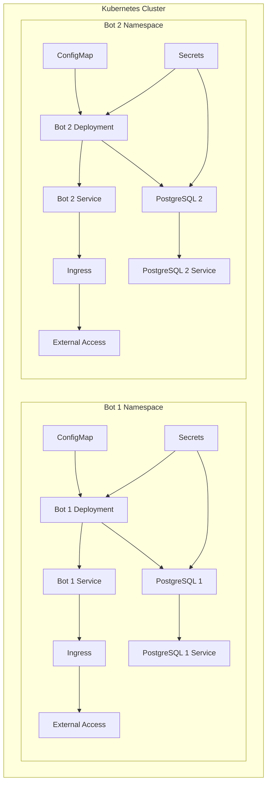

# curatedotfun-deploy

[Kubernetes](https://kubernetes.io/) deployment for [curatedotfun](https://github.com/PotLock/curatedotfun) using [Helm](https://helm.sh/) charts. This repository offers a hosted service of curatedotfun bots, each with their own PostgreSQL database.

## Architecture

The deployment architecture consists of multiple bot instances, each with its own PostgreSQL database. Each bot is exposed via an Ingress resource.



## Prerequisites

Before you begin, you'll need to set up your local environment:

### MacOS

1. Install either:
   - [Docker Desktop](https://www.docker.com/products/docker-desktop/) with Kubernetes enabled, or
   - [Orbstack](https://orbstack.dev/) (a lightweight alternative)

2. Install command-line tools:

   ```bash
   brew install kubectl helm
   ```

### Windows

1. Install [Docker Desktop](https://www.docker.com/products/docker-desktop/) with Kubernetes enabled

2. Install command-line tools:
   - [kubectl](https://kubernetes.io/docs/tasks/tools/install-kubectl-windows/)
   - [Helm](https://helm.sh/docs/intro/install/#from-chocolatey-windows)

   ```bash
   choco install kubernetes-cli
   choco install kubernetes-helm
   ```

## Configuration

The deployment is configured via the `values.yaml` file. This file contains the configuration for all bot instances and their associated PostgreSQL databases.

### Bot Configuration

Each bot is configured in the `bots` array in the `values.yaml` file:

```yaml
bots:
- name: bot1
  domain: bot1.example.com
  postgresUser: botuser1
  postgresDB: botdb1
  # dbPassword and encryptionKey are auto-generated
```

You can add as many bots as needed by adding more entries to the `bots` array.

### Default Configuration

Default configuration for all bots is specified in the `botDefaults` section:

```yaml
botDefaults:
  bot:
    image: your-registry/bot-image:latest
    replicaCount: 1
    servicePort: 8080
    resources:
      requests:
        cpu: 200m
        memory: 512Mi
      limits:
        cpu: 500m
        memory: 1Gi
```


## Deployment

To deploy the Helm chart:

```bash
helm install curatedotfun ./
```

To upgrade an existing deployment (when you've made changes to the configuration or when a new version is available):

```bash
helm upgrade curatedotfun ./
```

This allows you to update your deployment without downtime, applying only the changes that are needed while preserving the state of your application.

To uninstall the deployment:

```bash
helm uninstall curatedotfun
```

## Accessing the Application

Each bot is exposed via an Ingress resource at the domain specified in the `bots` array. For example, if you have a bot with `domain: bot1.example.com`, you can access it at `http://bot1.example.com`.

Make sure your DNS is configured to point to your Kubernetes cluster's ingress controller.

## Troubleshooting

### Check Pod Status

To check the status of your pods:

```bash
kubectl get pods
```

### View Pod Logs

To view the logs of a specific pod:

```bash
kubectl logs <pod-name>
```

### Check Ingress Status

To check the status of your ingress resources:

```bash
kubectl get ingress
```

### Common Issues

1. **Pods in CrashLoopBackOff state**: Check the pod logs for errors.
2. **Database connection issues**: Check the pod logs for database connection errors.
3. **Ingress not working**: Ensure your ingress controller is properly configured and your DNS is pointing to the correct IP address.

## Useful Links

- [Kubernetes Documentation](https://kubernetes.io/docs/home/)
- [Helm Documentation](https://helm.sh/docs/)
- [Nginx Ingress Controller](https://kubernetes.github.io/ingress-nginx/)
- [PostgreSQL Documentation](https://www.postgresql.org/docs/)
